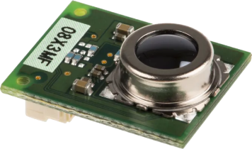
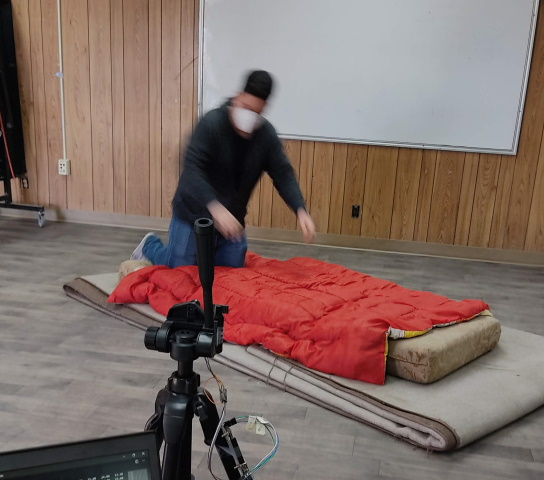
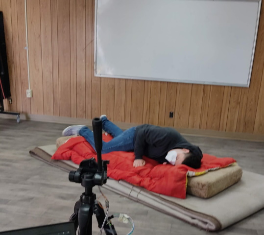

# Project description
This project contains data extracted from a thermal sensor using an Arduino UNO, the sensor was capturing falls of several people 
at different angles, so there are also non-fall events

### Omron D6T-44L-06

### Example pictures

## Data description
In this folder are contained two subfolders whose contains fall data and non fall data, each on their respective folder, 
each file has an unique name which starts as "f_" for fall files and "nf_" for non-fall files, all of which are in a CSV 
format, the data files contains a set of rows each file has a different number of rows, and each row contains 17 columns,
the first one is the timestamp of the sensor read and the 16 columns left, contains each sector temperature according to 
the next diagram, it is measured in ℃ most of files contains an average of 8 frames per second but could be more or less.

### Sectors of the sensor

Each sector of the sensor has a position so in the files at each row contains a timestamp, and the temperature of all the sectors
at that time.

Example:

| timestamp                  | 1    | 2    | 3    | 4    | 5    | 6    | 7    | 8    | 9    | 10   | 11   | 12   | 13   | 14   | 15   | 16   |
|----------------------------|------|------|------|------|------|------|------|------|------|------|------|------|------|------|------|------|
| 2021-03-24 20:50:27.099000 | 26.0 | 26.0 | 26.2 | 25.9 | 26.1 | 26.0 | 26.2 | 25.9 | 25.9 | 26.2 | 26.7 | 26.6 | 24.9 | 25.4 | 25.7 | 25.7 |
| 2021-03-24 20:50:27.104000 | 26.0 | 26.0 | 26.2 | 25.9 | 26.1 | 26.0 | 26.2 | 25.9 | 25.9 | 26.2 | 26.7 | 26.6 | 24.9 | 25.4 | 25.7 | 25.7 |
| 2021-03-24 20:50:28.280000 | 26.3 | 26.3 | 26.4 | 26.4 | 26.3 | 26.3 | 26.6 | 26.3 | 26.0 | 26.4 | 26.9 | 26.9 | 25.2 | 25.7 | 26.1 | 26.0 |
| ...                        | ...  | ...  | ...  | ...  | ...  | ...  | ...  | ...  | ...  | ...  | ...  | ...  | ...  | ...  | ...  | ...  |
| ...                        | ...  | ...  | ...  | ...  | ...  | ...  | ...  | ...  | ...  | ...  | ...  | ...  | ...  | ...  | ...  | ...  |
| ...                        | ...  | ...  | ...  | ...  | ...  | ...  | ...  | ...  | ...  | ...  | ...  | ...  | ...  | ...  | ...  | ...  |

Each file contains an event of a person falling or a non-fall event, depending on the speed and type of the event there will be more 
or less rows (frames), if we assume that the average is 8 fps, each file contains at least 13 frames (1.X seconds), and up to 400 
frames (40 seconds)

## Fall scenes

| Scene Name            | files         | Scene description                                   |
|-----------------------|---------------|-----------------------------------------------------|
| Normal fall scene     | f_1 - f_101   | Falling from left or the right side of the sensor   |
| Frontal fall scene    | f_102 - f_122 | Falling towards to the sensor                       |
| Chair fall scene 1    | f_123 - f_148 | Falling from a chair                                |
| Chair fall scene 2    | f_149 - f_163 | Falling from a chair sideways                       |
| Chair fall scene 3    | f_164 - f_173 | Falling from a chair sideways                       |
| Near fall scene       | f_174 - f_208 | Falling from left to right but closer to the sensor |
| Diagonal fall scene 1 | f_209 - f_222 | Falling in an angle towards the sensor              |
| Diagonal fall scene 2 | f_223 - f_238 | Falling in an angle towards the sensor              |

## Non-fall scenes

| Scene                         | files            | Scene description                                       |
|-------------------------------|------------------|---------------------------------------------------------|
| walking scene                 | nf_1 - nf_94     | Walking from left to right and right to left            |
| walking picking scene         | nf_95 - nf_136   | Simulating a walk and picking something from the ground |
| walking sitting scene         | nf_137 - nf_182  | Walking side to side and sitting in different positions |
| frontal walking scene         | nf_183 - nf_191  | Walking towards the sensor                              |
| frontal walking picking scene | nf_192 - nf_212  | Walking and picking towards the sensors                 |
| bed scene                     | nf_213  - nf_246 | Walking to a "bed" and lying on it                      |